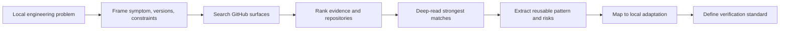

<!-- markdownlint-disable MD013 MD033 -->

<h1 align="center">GitHub Solution Research</h1>

<p align="center">
  A Codex skill for turning concrete engineering blockers into GitHub-backed evidence, repository comparisons, and local implementation plans.
</p>

<p align="center">
  <a href="#简体中文">简体中文</a>
  ·
  <a href="#english">English</a>
  ·
  <a href="#license">License</a>
</p>

<p align="center">
  
  
  
  
</p>

> **Status boundary / 状态边界**
>
> This repository packages a Codex skill and two lightweight GitHub Search API helpers. It helps research public open-source evidence; it is not an automatic fixer, not a vulnerability scanner, and not a guarantee that GitHub contains the answer.
>
> 本仓库打包的是一个 Codex skill，以及两个轻量级 GitHub Search API 辅助脚本。它用于研究公开开源证据；它不是自动修复器，不是漏洞扫描器，也不保证 GitHub 一定有答案。

## 友链 / Community

本项目接受 LINUX DO 社区佬友监督与反馈：[LINUX DO](https://linux.do/)

## 简体中文

### 项目定位

GitHub Solution Research 是一个可独立安装的 Codex skill，用于把具体工程问题转化为有证据的 GitHub 开源研究流程：搜索公开仓库、issue、PR、discussion、代码、示例和 release notes，比较候选项目，再把可复用模式落到本地修复、实现方案或验证计划中。

它适合处理“这个问题别人是否已经在开源项目里解决过”的场景。它不适合替代本地调试、官方文档核对、代码审查或安全审计，也不应该被用来复制私有仓库、token、cookie、凭证或大段第三方代码。

### Features

| 能力 | 已包含内容 | 边界 |
| --- | --- | --- |
| 问题证据搜索 | `scripts/github_problem_search.py` 可搜索 issues、PRs、repositories、code | 只返回候选元数据；最终判断必须深读证据和本地代码 |
| 仓库候选研究 | `scripts/github_repo_research.py` 按 Stars、语言、topic、活跃度筛选公开仓库 | Stars 是成熟度信号，不是适用性证明 |
| 研究方法约束 | `SKILL.md`、`references/research-rubric.md`、`references/extraction-playbook.md` 定义搜索、排序、提取和输出标准 | 不保证搜索结果完整，不替代官方文档或维护者确认 |
| Codex 集成 | `agents/openai.yaml` 提供可识别的 skill 展示信息和默认 prompt | 仍需要用户在本机 Codex skill 目录中安装 |

### When to use

使用这个 skill：

- 构建、运行、测试、部署、SDK、API、依赖、框架或集成问题可能已有开源先例。
- 某个功能实现卡在 API 用法、边界条件、版本差异或配置形态上。
- 你需要比较多个 GitHub 项目，并说明 Stars、license、活跃度、适配成本和风险。
- 你需要从 issue、PR、release notes、示例代码或测试中提取可落地的修复模式。
- 你希望在写本地方案前先明确：可复用什么、必须适配什么、不能复制什么、如何验证。

不要使用它：

- 文案、小型本地重构、或代码库已经明确给出答案的改动。
- 用户明确禁止联网或 GitHub 研究的任务。
- 未获授权的私有仓库、凭证、cookie、token、公司内部代码或不可公开上下文。
- 需要直接修复生产事故但尚未完成本地日志、状态和官方文档核对的情况。

### How it works



默认研究路径：

1. 先在本地定义问题：目标、症状、错误文本、版本、运行环境、约束和已尝试方案。
2. 选择证据面：错误和回归优先搜 issue/PR/release/code；能力选型优先搜仓库候选；实现卡点两者都用。
3. 用精确查询搜索公开 GitHub：错误文本、包名、API 名、版本号、配置键、框架和失败命令。
4. 按问题匹配度、证据强度、本地适用性、可操作性和项目成熟度排序。
5. 深读最强候选，提取可复用接口、配置、测试、工作流、风险和 license 边界。
6. 输出本地修复或实施建议，并给出验证命令、真实请求、测试或人工检查标准。

### Installation

安装到默认 Codex skill 目录：

```bash
mkdir -p ~/.codex/skills
git clone https://github.com/Jia-Ethan/github-solution-research.git \
  ~/.codex/skills/github-solution-research
```

更新已有安装：

```bash
git -C ~/.codex/skills/github-solution-research pull --ff-only
```

这个 skill 没有第三方 Python 依赖。两个辅助脚本只使用 Python 标准库，并在有可用认证时读取 `GITHUB_TOKEN`、`GH_TOKEN` 或本机 `gh auth token`。不要把 token 粘贴到 prompt、README、日志或仓库文件里。

### Usage examples

在 Codex 中调用 skill：

```text
Use $github-solution-research to investigate this Vite build error.
Find matching GitHub issues, merged PRs, release notes, and reusable fixes,
then recommend the smallest local adaptation and verification command.
```

搜索问题证据：

```bash
python scripts/github_problem_search.py \
  --query '"ERR_PACKAGE_PATH_NOT_EXPORTED" vite plugin' \
  --surface all \
  --limit 5 \
  --markdown
```

在某个仓库内搜索匹配 issue 或 PR：

```bash
python scripts/github_problem_search.py \
  --query '"Cannot find module" "Node.js 22"' \
  --repo owner/repo \
  --surface issues \
  --limit 8 \
  --markdown
```

搜索可复用项目候选：

```bash
python scripts/github_repo_research.py \
  --query "browser automation agent" \
  --language Python \
  --min-stars 500 \
  --limit 8 \
  --markdown
```

### Output contract

当这个 skill 实质影响结论时，回答应包含：

- 本地问题画像：目标、症状、版本、环境和约束。
- 搜索路径：查询词、搜索面、候选来源。
- 候选项目：repo、Stars、forks、语言、license、活跃度、基本内容、匹配理由和适配成本。
- 关键证据：issue、PR、代码、示例、release notes 或文档链接，以及为什么匹配。
- 推荐方案：直接复用什么、本地适配什么、避免复制什么。
- 风险和拒绝项：旧版本、不适配、license、隐私、安全或部署风险。
- 验证标准：测试、构建、复现命令、真实请求或人工检查。
- 置信度：证据弱或没有强匹配时必须明确说明。

### Security

- 默认只研究公开 GitHub 内容。私有仓库必须由用户明确授权并限定范围。
- 不要把 GitHub token、cookie、密码、API key、私有仓库内容或公司内部上下文写入 prompt、输出、日志、README、脚本或记忆文件。
- 辅助脚本会在运行时读取 `GITHUB_TOKEN`、`GH_TOKEN` 或 `gh auth token`，仅用于请求头；错误输出会尝试脱敏当前 token。
- 不要复制大段第三方代码。优先复用公开接口、配置形态、工作流、测试模式和架构思路；如需代码复用，先检查 license 和归属要求。
- 对安全、支付、鉴权、基础设施或生产运维类问题，GitHub 证据必须与当前官方文档或官方仓库交叉验证。

### Status boundaries and roadmap

当前已包含：

- Codex skill 主入口：`SKILL.md`
- OpenAI agent metadata：`agents/openai.yaml`
- 研究评分和提取参考：`references/`
- GitHub Search API 辅助脚本：`scripts/`

可改进方向：

- 增加更结构化的 JSON schema 输出。
- 增加针对常见语言生态的查询模板。
- 增加离线示例夹具，方便在不访问 GitHub API 时演示输出格式。
- 增加 CI，检查 Python 语法、README 链接和敏感信息模式。

不会承诺：

- 自动修复本地代码。
- 自动判断所有 GitHub 结果真假。
- 保证每个工程问题都有公开答案。
- 在未授权范围内读取或复制私有代码。

### License

MIT License. See [LICENSE](LICENSE).

## English

### Project positioning

GitHub Solution Research is an independently installable Codex skill for turning concrete engineering problems into evidence-backed GitHub research. It searches public repositories, issues, PRs, discussions, code, examples, and release notes; compares candidate repositories; and maps reusable patterns into local fixes, implementation plans, or verification standards.

Use it when the real question is: "Has the open-source ecosystem already solved something close enough to this problem?" It does not replace local debugging, official documentation, code review, or security review. It must not be used to copy private repositories, tokens, cookies, credentials, or large chunks of third-party code.

### Features

| Capability | Included | Boundary |
| --- | --- | --- |
| Problem evidence search | `scripts/github_problem_search.py` searches issues, PRs, repositories, and code | Returns candidate metadata only; final judgment requires deep-reading evidence and local code |
| Repository candidate research | `scripts/github_repo_research.py` filters public repositories by Stars, language, topic, and activity | Stars are maturity signals, not proof of fit |
| Research discipline | `SKILL.md`, `references/research-rubric.md`, and `references/extraction-playbook.md` define search, ranking, extraction, and output standards | Does not guarantee complete search coverage or replace official docs |
| Codex integration | `agents/openai.yaml` provides skill-facing display metadata and a default prompt | Users still need to install it into their local Codex skills directory |

### When to use

Use this skill when:

- A build, runtime, test, deploy, SDK, API, dependency, framework, or integration blocker may have an open-source precedent.
- A feature is blocked by unclear API usage, edge cases, version behavior, or configuration shape.
- You need to compare GitHub projects by Stars, license, activity, fit, adaptation cost, and risk.
- You need to extract actionable patterns from issues, PRs, release notes, examples, or tests.
- You want a clear answer on what to reuse, what to adapt locally, what not to copy, and how to verify.

Do not use it for:

- Copy edits, tiny local refactors, or changes where the existing codebase already dictates the answer.
- Tasks where the user explicitly forbids network or GitHub research.
- Unauthorized private repositories, credentials, cookies, tokens, internal company code, or non-public context.
- Production incidents where local logs, runtime state, and official docs have not been checked first.

### How it works


Default research path:

1. Frame the local problem: goal, symptom, error text, versions, runtime, constraints, and attempted fixes.
2. Choose the evidence surface: issues, PRs, releases, and code for errors; repository candidates for reusable capabilities; both for implementation blockers.
3. Search public GitHub with targeted queries: exact errors, package names, API names, versions, config keys, frameworks, and failing commands.
4. Rank by problem fit, evidence strength, local applicability, actionability, and project maturity.
5. Deep-read the strongest candidates and extract reusable interfaces, configuration, tests, workflows, risks, and license boundaries.
6. Produce a local fix or implementation recommendation with a concrete verification command, request, test, or manual check.

### Installation

Install into the default Codex skills directory:

```bash
mkdir -p ~/.codex/skills
git clone https://github.com/Jia-Ethan/github-solution-research.git \
  ~/.codex/skills/github-solution-research
```

Update an existing installation:

```bash
git -C ~/.codex/skills/github-solution-research pull --ff-only
```

This skill has no third-party Python dependency. Both helper scripts use only the Python standard library and read `GITHUB_TOKEN`, `GH_TOKEN`, or local `gh auth token` when authentication is available. Do not paste tokens into prompts, READMEs, logs, or repository files.

### Usage examples

Invoke the skill in Codex:

```text
Use $github-solution-research to investigate this Vite build error.
Find matching GitHub issues, merged PRs, release notes, and reusable fixes,
then recommend the smallest local adaptation and verification command.
```

Search problem evidence:

```bash
python scripts/github_problem_search.py \
  --query '"ERR_PACKAGE_PATH_NOT_EXPORTED" vite plugin' \
  --surface all \
  --limit 5 \
  --markdown
```

Search matching issues or PRs in one repository:

```bash
python scripts/github_problem_search.py \
  --query '"Cannot find module" "Node.js 22"' \
  --repo owner/repo \
  --surface issues \
  --limit 8 \
  --markdown
```

Search reusable repository candidates:

```bash
python scripts/github_repo_research.py \
  --query "browser automation agent" \
  --language Python \
  --min-stars 500 \
  --limit 8 \
  --markdown
```

### Output contract

When this skill materially affects an answer, the answer should include:

- Local problem profile: goal, symptom, versions, environment, and constraints.
- Search path: queries, GitHub surfaces, and discovery methods used.
- Repository candidates: repo, Stars, forks, language, license, activity, basic content, fit rationale, and adaptation cost.
- Key evidence: links to issues, PRs, code, examples, release notes, or docs, with match rationale.
- Recommended solution: what to reuse directly, what to adapt locally, and what to avoid copying.
- Rejected or risky options: stale versions, mismatches, license, privacy, security, or deployment risks.
- Verification standard: test, build, reproduction command, real request, or manual check.
- Confidence label when evidence is weak or no strong GitHub solution was found.

### Security

- The default scope is public GitHub content. Private repositories require explicit user authorization and a bounded scope.
- Do not write GitHub tokens, cookies, passwords, API keys, private repository contents, or internal company context into prompts, outputs, logs, READMEs, scripts, or memory files.
- The helper scripts read `GITHUB_TOKEN`, `GH_TOKEN`, or `gh auth token` at runtime and use it only in the request header; error output attempts to redact the current token.
- Avoid copying large blocks of third-party code. Prefer public APIs, configuration shapes, workflows, test patterns, and architecture ideas. If code reuse is necessary, check the license and attribution obligations first.
- For security, payments, auth, infrastructure, or production operations, cross-check GitHub findings against current official docs or official repositories.

### Status boundaries and roadmap

Currently included:

- Codex skill entrypoint: `SKILL.md`
- OpenAI agent metadata: `agents/openai.yaml`
- Research rubric and extraction references: `references/`
- GitHub Search API helper scripts: `scripts/`

Possible improvements:

- Add a structured JSON schema for research outputs.
- Add query templates for common language ecosystems.
- Add offline sample fixtures for demonstrating output shape without GitHub API access.
- Add CI for Python syntax, README links, and sensitive-content pattern checks.

This project does not promise to:

- Automatically fix local code.
- Automatically judge every GitHub result as true or false.
- Guarantee a public answer for every engineering problem.
- Read or copy private code outside the user's authorized scope.

### License

MIT License. See [LICENSE](LICENSE).
