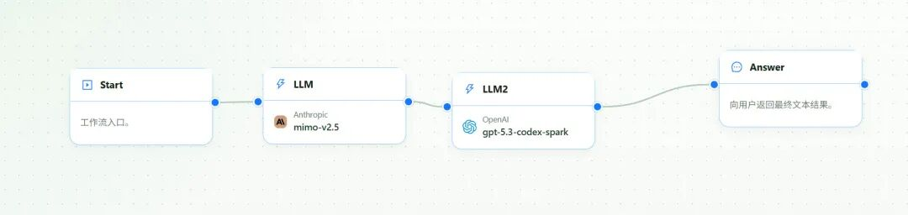
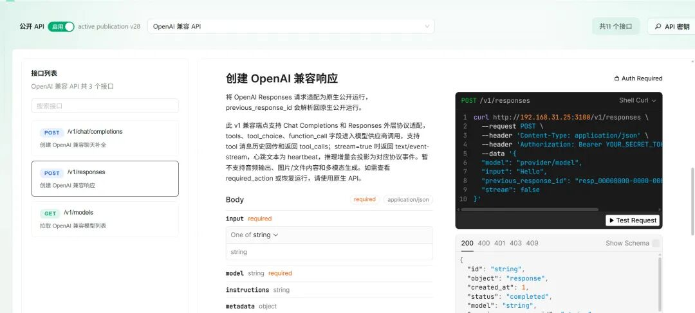
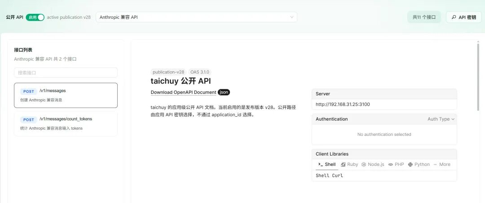
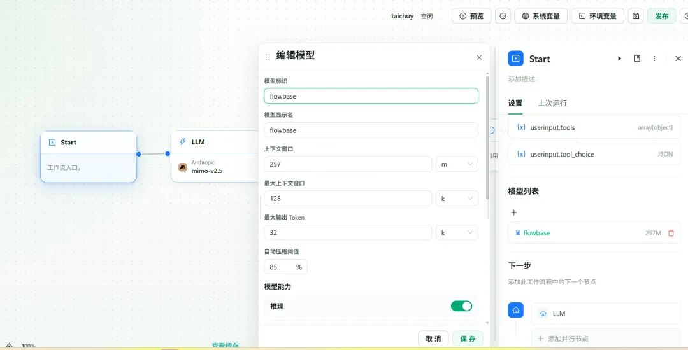
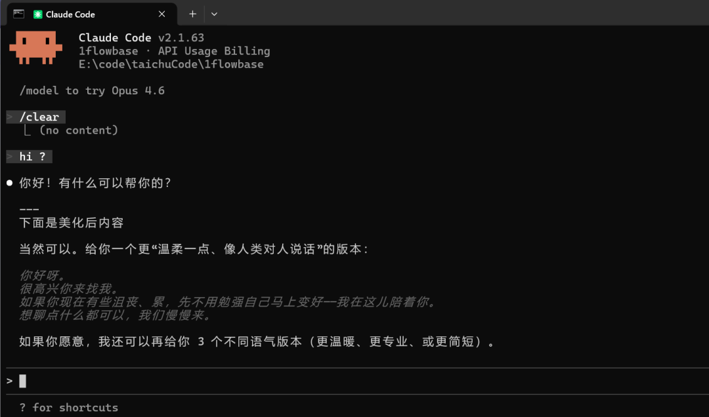
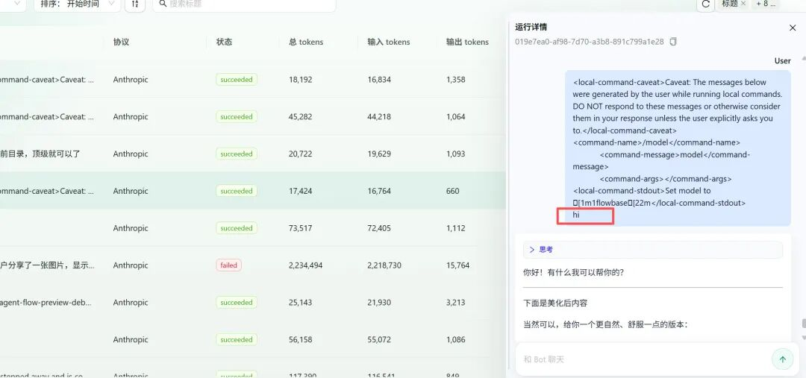
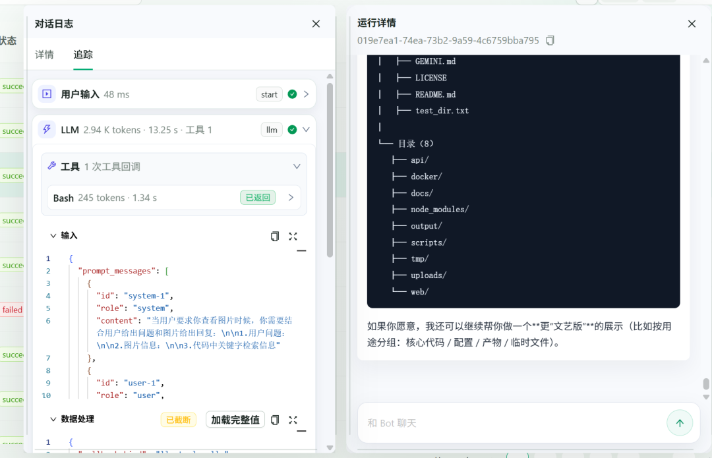
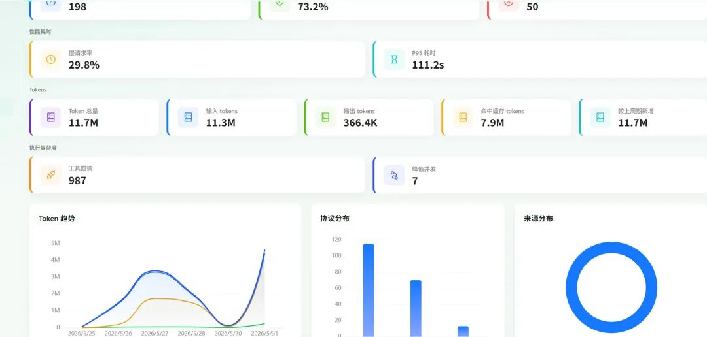

# 1flowbase

<p align="center">
  
</p>

<p align="center">
  <b>English</b> | <a href="docs/READEME-i18n/README_CN.md">简体中文</a>
</p>

<p align="center">
  <strong>💬 Community:</strong> <a href="docs/assets/community/wechat.jpg" target="_blank">WeChat</a> | <a href="docs/assets/community/taichuy_doc_wechat_office.jpg" target="_blank">WeChat Official Account</a> | <a href="https://x.com/Tacihu2021" target="_blank">Twitter</a>
</p>


> **Open-source virtual model gateway for local AI agent clients.**
> **The first step to harness is to see the Agent's execution path clearly**

1flowbase lets you build multi-model workflows, publish them as OpenAI / Claude-compatible model endpoints, and inspect what happened behind each request: model calls, node inputs and outputs, tool callbacks, tokens, latency, failures, and cost.

Use it to:

- compose multiple models, tools, verifiers, routers, and formatters into one workflow
- expose that workflow through OpenAI Responses, OpenAI Chat Completions, or Claude-compatible Messages APIs
- call the workflow from compatible local AI clients and SDKs that support custom model endpoints
- debug execution node by node instead of only seeing the final answer
- optimize cost with model cascading, fallback, verification, and formatting steps

> LiteLLM routes models.  
> 1flowbase composes models into workflow-backed virtual model endpoints.

```text
Build workflow → Publish endpoint → Call from clients → Inspect trace / tokens / cost → Optimize
```

---

## Why?

Many AI tools only show the final response. A real AI request may include far more than the visible user message:

```text
user input + system prompt + developer prompt + tool definitions + project context
+ chat history + command outputs + intermediate model calls + verifier / formatter steps
```

That hidden execution path affects token cost, latency, model behavior, failure rate, output quality, and unit economics.

A short input like `hi` can still become an expensive request once the surrounding context, tool schemas, history, and workflow steps are attached.

1flowbase helps you see the workflow behind the request, then optimize it with real runtime data instead of guesswork.

---

## What works today

Current focus: **workflow-backed virtual model endpoints** and **execution visibility inside 1flowbase workflows**.

Implemented:

- visual workflow editor
- multi-node workflow orchestration
- virtual model endpoint publishing
- OpenAI Responses API support
- OpenAI Chat Completions API support
- Claude-compatible Messages API support
- streaming response support
- basic execution logs
- tool callback traces inside 1flowbase workflows
- application-level token statistics
- prompt and model configuration version history

In progress:

- deeper local agent conversation collection
- session search and playback
- Token Bill of Materials: system prompts, tool definitions, history, command outputs, and node-level sources
- abnormal cost detection
- Recall Pack export
- more Claude Code / Codex / aionui templates
- MCP-aware plugin nodes and tool-call source attribution

> Note: 1flowbase is not currently positioned as an MCP server or MCP gateway. MCP-aware capabilities are on the roadmap. The current product focuses on publishing compatible model endpoints and tracing 1flowbase workflow execution.

---

## How it works

### 1. Build a workflow

```text
Vision Model → Small Model → Strong Reasoning Model → Verifier → Formatter
```

### 2. Publish it as a model endpoint

```text
/v1/responses
/v1/chat/completions
/v1/messages
```

### 3. Call it from existing clients

To the client, it looks like a normal model. To you, it is an observable and tunable workflow.

### 4. Inspect the execution

```text
Request
  → workflow node inputs
  → model calls
  → tool callbacks
  → node outputs
  → token usage / latency / errors
  → final response
```

### 5. Optimize and reuse

Compress prompts, split long context, move simple steps to cheaper models, add verifiers / formatters, add fallback strategies, then publish the optimized workflow as a reusable virtual model.

---

## Quick Start

### One-click Docker deployment

The script checks whether Docker / Compose is available, pulls the `docker/` directory, and copies `docker/.env.example` to `docker/.env`.

```bash
curl -fsSL https://raw.githubusercontent.com/taichuy/1flowbase/main/scripts/shell/docker-deploy.sh | sh
```

PowerShell:

```powershell
irm https://raw.githubusercontent.com/taichuy/1flowbase/main/scripts/powershell/docker-deploy.ps1 | iex
```

Windows CMD:

```bat
powershell -NoProfile -ExecutionPolicy Bypass -Command "irm https://raw.githubusercontent.com/taichuy/1flowbase/main/scripts/powershell/docker-deploy.ps1 | iex"
```

### Run from source

Requirements: Node.js `>= 24.0.0`, latest stable Rust, and Docker for local middleware.

```bash
git clone https://github.com/taichuy/1flowbase.git
cd 1flowbase

docker compose -f docker/docker-compose.middleware.yaml up -d

cd web
pnpm install
pnpm dev
```

Frontend:

```text
http://127.0.0.1:3100
```

Start backend services:

```bash
cd api
# Copy api/apps/api-server/.env.example to .env before the first run.
cargo run -p api-server --bin api-server
cargo run -p plugin-runner --bin plugin-runner
```

Default backend endpoints:

```text
API Server: http://127.0.0.1:7800
Plugin Runner: http://127.0.0.1:7801
```

Script-assisted startup:

```bash
node scripts/node/dev-up.js
node scripts/node/dev-up.js status
node scripts/node/dev-up.js stop
node scripts/node/dev-up.js restart
```

See [scripts/README.md](scripts/README.md) for more options.

---

## Feature preview

### Build multi-model workflows

Create workflows with multiple models, tools, verifiers, and formatter nodes.



### Publish as OpenAI-compatible API



### Publish as Claude-compatible Messages API



### Customize exposed model information



### Use in compatible local AI clients

Call a published workflow from compatible clients that support custom model endpoints.



### View execution logs

Inspect model requests, node inputs and outputs, tool callbacks, response content, latency, and errors.



### View tool callback traces



### Track token consumption



---

## Protocol compatibility

| Protocol | API path | Typical usage |
|---|---:|---|
| OpenAI Responses API | `/v1/responses` | newer OpenAI-style clients and application code |
| OpenAI Chat Completions API | `/v1/chat/completions` | SDKs, coding tools, chat clients, application frameworks |
| Claude-compatible Messages API | `/v1/messages` | Claude-compatible clients that support custom endpoints |

Build one workflow, then expose it through multiple protocols.

---

## Typical use cases

### Add vision or OCR before a text model

```text
Image / screenshot / PDF → Vision or OCR node → structured text context → strong text model → verifier → final answer
```

### Control cost with model cascading

```text
Simple classification → small model
Formatting → small model
Complex reasoning → strong model
Final verification → verifier node
```

### Guarantee output structure

Use verifiers, JSON schema validation, and formatter nodes before returning the final result. This is useful for JSON outputs, API responses, tool call parameters, code patches, document generation, and automated task results.

### Build a programmable upstream model for coding agents

```text
Code generation → test / lint check → reviewer node → fix node → final patch
```

Existing clients call one model name, while 1flowbase runs the workflow behind it.

### Debug workflow execution

Use execution logs and traces to answer which node failed, which model call was slow, which step used the most tokens, which tool callback returned unexpected output, and which verifier or formatter changed the final response.

---

## How 1flowbase differs

1flowbase is not just a model proxy and not just a generic workflow canvas.

It focuses on one gap:

> Build a multi-model workflow, publish it as a standard model endpoint, and inspect the execution behind it.

| Tool category | What it usually does | How 1flowbase is different |
|---|---|---|
| Model router / LLM gateway | routes one request to one provider or model | composes multiple model and tool nodes into one workflow-backed virtual model |
| AI workflow builder | builds an AI app or workflow | exposes the workflow as OpenAI / Claude-compatible model APIs |
| Agent framework | helps developers code agent graphs | provides a visual runtime, protocol publishing, and execution logs |
| Cost tracker | shows token or spend totals | connects cost to workflow nodes, model calls, and execution traces |

```text
Model routers choose a model.
1flowbase builds a new virtual model from a workflow.
```

---

## Transparency and security

1flowbase is designed for transparent, self-hosted AI workflow execution.

Recommended principles:

- self-hosted first
- transparent model chains
- auditable node calls
- traceable token usage
- configurable log retention
- sensitive data masking
- explicit model and workflow configuration

1flowbase does not advocate stealthy model replacement. Published endpoints should be configured intentionally, observed clearly, and governed by the project owner.

---

## Roadmap

### Implemented

- [x] visual workflow editor
- [x] multiple built-in node types
- [x] virtual model endpoint publishing
- [x] OpenAI Responses protocol support
- [x] OpenAI Chat Completions protocol support
- [x] Claude-compatible Messages protocol support
- [x] streaming response support
- [x] basic execution logs
- [x] tool callback traces inside 1flowbase workflows
- [x] application-level token consumption statistics
- [x] prompt and model configuration version history

### Enhancing

- [ ] enhanced local agent conversation collection
- [ ] Token Bill of Materials by prompt, history, tool definitions, command outputs, and nodes
- [ ] agent session search and playback
- [ ] session export and Recall Pack generation
- [ ] abnormal cost detection and optimization suggestions
- [ ] more Claude Code / Codex / aionui usage templates
- [ ] MCP-aware plugin nodes and tool-call source attribution

### Planned

- [ ] low-code application building platform for AI organizations
- [ ] team workspace and multi-tenant management
- [ ] permissions, approval, audit, and cost governance
- [ ] support for more local AI agent clients
- [ ] template market and workflow recipe ecosystem

---

## Repo layout

```text
web/          Frontend root, powered by pnpm + Turbo
api/          Rust backend workspace
api/apps/     Backend service entry points
api/crates/   Shared backend crates
api/plugins/  Plugin workspace, HostExtension manifests, and templates
docker/       Local middleware orchestration
scripts/      Development, testing, verification, and debugging scripts
```

---

## Contributing

Contributions are welcome. Before submitting a pull request, run:

```bash
node scripts/node/verify.js repo
```

Project guidelines:

- [AGENTS.md](AGENTS.md)
- [web/AGENTS.md](web/AGENTS.md)
- [api/AGENTS.md](api/AGENTS.md)

---

## Acknowledgements

Thanks to [Linux.do](https://linux.do/) — Learn AI on L-Station.

---

## License

This project is licensed under [Apache-2.0](LICENSE).

---

## Contributors

<p align="center">
  <a href="https://github.com/taichuy/1flowbase/graphs/contributors">
    
  </a>
</p>

---

## Star History

<p align="center">
  <a href="https://www.star-history.com/#taichuy/1flowbase&Date" target="_blank">
    
  </a>
</p>

---

<div align="center">

**If you want to build workflow-backed virtual models and see what happened behind each request, give 1flowbase a star.**

[Report Bug](https://github.com/taichuy/1flowbase/issues) · [Request Feature](https://github.com/taichuy/1flowbase/issues)

</div>
