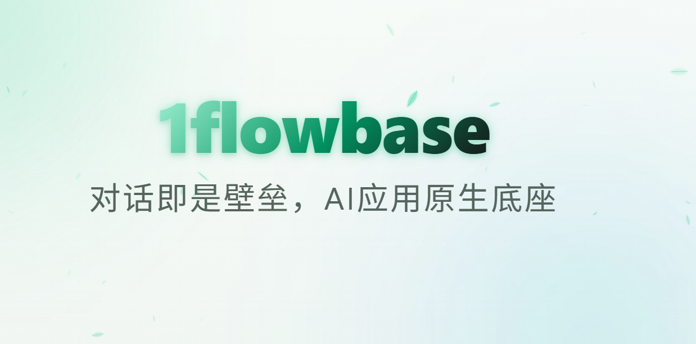

# 1flowbase

<p align="center">
  
</p>

<p align="center">
  <b>English</b> | <a href="docs/READEME-i18n/README_CN.md">简体中文</a>
</p>

> **Dialogue is the Moat, the AI-Native Application Foundation**

1flowbase is designed to provide a unified foundation for future AI-native applications and AI-Native Organizations.

## 💡 Core Features

*   💬 **Virtual Model Endpoint**: Externally, the Virtual Model interface functions as a standard LLM API, but internally it executes full, multi-model orchestration workflows. Compatible with OpenAI/Anthropic protocols.
*   📜 **Full Chat History & Tool Callback Logs (Chat Logs & Tool Trace)**: Features a built-in full-link trace tracking system to precisely reconstruct the workflow execution path, node inputs/outputs, and tool callback details behind every conversation.
*   🤖 **Native Multi-Agent Client Support (Multi-Agent Clients)**: Native support and adaptation for multiple local agents and client tools (such as aionui, codex, Claude Code, etc.), offering seamless protocol integration and relay capabilities.

---

## 💡 What is a Virtual Model?

<p align="center">
  <video src="docs/assets/claude_code_use.mp4" width="100%" controls></video>
</p>

Externally, the Virtual Model interface behaves like a standard LLM API, but internally it executes a complete, multi-model orchestration workflow.

For example, an external call:
```json
{
  "model": "deepseek-with-vision",
  "messages": [
    {
      "role": "user",
      "content": "Analyze this screenshot and suggest a fix."
    }
  ]
}
```

Internally, it actually runs:
```text
Gemini Vision (Visual Context Extraction) 
  → DeepSeek-v4 (Reasoning & Thinking) 
  → Dedicated Verification Model (JSON Schema Validation) 
  → Final OpenAI-Compatible Response Generation
```

To the calling client, it is just a single model; to you, it is a fully programmable AI workflow.

---

## 🎯 Why Choose 1flowbase?

Most AI tools only allow you to choose a **single model**. However, real production-grade AI systems typically require multi-step orchestration:
* **Multimodal Enhancement**: Use a Vision model as the "eyes" to read images or PDFs and extract context, then let a powerful reasoning model act as the "brain" to process it.
* **Smart Cost Control**: Use lightweight, inexpensive models for upfront classification and filtering, and only invoke high-cost models when heavy reasoning is required.
* **Reliability Assurance**: Introduce dedicated miniature models as result verifiers (`Verifier Node`) or formatters (`Formatter Node`) to ensure the output strictly adheres to a specific JSON schema.

1flowbase encapsulates this complex multi-model orchestration (Workflows) into standard, out-of-the-box model endpoints (Drop-in Endpoints).

You only need to configure your client just like calling any ordinary API:
```bash
OPENAI_BASE_URL=http://localhost:3000/v1
OPENAI_API_KEY=your-key
MODEL=deepseek-with-vision
```

---

## 🔌 Protocol Compatibility

1flowbase supports exposing the same workflow through multiple mainstream protocols:

| Protocol | API Path | Typical Clients |
|---|---|---|
| **OpenAI Responses API** | `/v1/responses` | Next-generation OpenAI primitives clients |
| **OpenAI Chat Completions** | `/v1/chat/completions` | Cline, Roo Code, traditional SDKs, and development frameworks |
| **Claude-compatible Messages** | `/v1/messages` | Claude SDK / Native Claude clients |

---

## ⚔️ How 1flowbase Differs from Others

| Tool | Core Philosophy | 1flowbase Key Differences |
|---|---|---|
| **LiteLLM** | Proxies and routes multiple LLM endpoints | LiteLLM routes models; 1flowbase combines models and generates new model interfaces |
| **LangGraph** | Builds controllable Agent workflows in code | 1flowbase publishes complex orchestration graphs as standard, drop-in APIs without client modifications |
| **Dify / Flowise** | Builds visual AI applications and workflows | 1flowbase focuses on integrating multi-model streams into the existing ecosystem just like a single model |

> **Key takeaway**: LiteLLM routes models, 1flowbase combines models.

---

## 🛠️ Typical Scenarios

* **Equip Text-Only Models with Missing Capabilities**: Cascade a Gemini Vision or OCR node before invoking a powerful reasoning model that lacks native vision support.
* **Build a Custom Brain for Coding Agents**: Package complex "code generation → Clippy verification → syntax repair" loops into a virtual model to make your agent smarter without changing the client.
* **Control Costs via Model Cascading**: Filter standard requests with small models and only delegate complex queries to premium reasoning models.
* **Ensure Structured and High-Quality Output**: Detect and repair corrupted JSON formats using a dedicated structure verification node before the final response is returned.

---

## 🗺️ Roadmap

### Implemented Core Features
- [x] **Low-code visual workflow editor**
- [x] **Multiple built-in node types and hybrid orchestration**
- [x] **Cost and latency trace dashboard**
- [x] **Prompt and model configuration version history management**
- [x] **OpenAI Responses protocol and streaming output support**
- [x] **Claude Messages protocol and streaming output support**

### Upcoming Features
- [ ] **Native conversation collection & full-link trace logs** — The crucial first step to accumulating an organization-specific "conversation moat".
- [ ] **End-to-end AI-native low-code application builder** — Extending from virtual endpoints to full AI applications.
- [ ] **Enterprise-grade team workspace & multi-tenant management**
- [ ] **Enhanced MCP (Model Context Protocol) plugin nodes support**

---

## 📂 Repo Layout

*   `web/`: Frontend root directory, powered by `pnpm + Turbo`. The entry application is located at `web/app`, and shared packages reside under `web/packages/*`.
*   `api/`: Backend root directory, structured as a Rust workspace. Service entry points are located at `api/apps/*`, and shared crates reside under `api/crates/*`.
*   `api/plugins/`: Plugin source code workspace, HostExtension manifests, and templates.
*   `docker/`: Container orchestration for local middleware (PostgreSQL, Redis, etc.).
*   `scripts/`: Repository-level development, testing, verification, and debugging scripts. For details, see [scripts/README.md](scripts/README.md).

---

## 🚀 Quick Start

### One-Click Docker Deployment (Recommended)

The following commands will not install Docker itself. The deployment script will check if a working Docker/Compose environment is available on your machine, clone the `docker/` directory to the current path, and copy `docker/.env.example` to `docker/.env`.

#### Shell

```bash
curl -fsSL https://raw.githubusercontent.com/taichuy/1flowbase/main/scripts/shell/docker-deploy.sh | sh
```

#### PowerShell

```powershell
irm https://raw.githubusercontent.com/taichuy/1flowbase/main/scripts/powershell/docker-deploy.ps1 | iex
```

#### Windows CMD

```bat
powershell -NoProfile -ExecutionPolicy Bypass -Command "irm https://raw.githubusercontent.com/taichuy/1flowbase/main/scripts/powershell/docker-deploy.ps1 | iex"
```

---

### Run from Source (Development Mode)

#### Environment Requirements
*   **Node.js**: `>= 24.0.0`
*   **Rust**: Latest stable compiler (Workspace)
*   **Docker**: For running required development middleware

#### 1. Clone the Repository

```bash
git clone https://github.com/taichuy/1flowbase.git
```

#### 2. Start Middleware
```bash
docker compose -f docker/docker-compose.middleware.yaml up -d
```

#### 3. Start the Frontend
```bash
cd web
pnpm install
pnpm dev
```
*   Frontend access URL: `http://127.0.0.1:3100`

#### 4. Start the Backend
Before launching for the first time, make sure to copy `api/apps/api-server/.env.example` to `.env` and configure it.
```bash
cd api
# Run the API server
cargo run -p api-server --bin api-server
# Run the plugin runner
cargo run -p plugin-runner --bin plugin-runner
```
*   API Server: `http://127.0.0.1:7800`
*   Plugin Runner: `http://127.0.0.1:7801`

---

## ⚙️ Script-Assisted Startup

To simplify the local development process, the repository provides a unified Node utility script for one-click development startup:

```bash
# Fully spin up the frontend, backend, middleware, and plugin runner
node scripts/node/dev-up.js

# Spin up only the frontend and backend processes, skipping Docker middleware
node scripts/node/dev-up.js --skip-docker

# Common operations
node scripts/node/dev-up.js status   # Check the status of each service
node scripts/node/dev-up.js stop     # Stop all running local services
node scripts/node/dev-up.js restart  # Restart services
```

For more advanced script options such as UI debugging, automation testing, and cache cleaning, please refer to [scripts/README.md](scripts/README.md).

---

## 🤝 Contributing

We highly welcome contributions from the community and team members! Before submitting a Pull Request, please ensure you have completed the following local validations:

### Local Testing and Verification
```bash
# Run the repository-level complete gatekeeper (includes Rust formatting/Clippy/tests, and frontend verification & contract tests)
node scripts/node/verify.js repo
```

### Collaborative Guidelines
*   Development and quality control guidelines are governed by [AGENTS.md](AGENTS.md) in the root directory.
*   Frontend quality requirements can be found in [web/AGENTS.md](web/AGENTS.md).
*   Backend quality requirements can be found in [api/AGENTS.md](api/AGENTS.md).

---

## 🏆 Acknowledgements

Thanks to [Linux.do](https://linux.do/) - Learn AI on L-Station.

---

## License

This project is licensed under [Apache-2.0](LICENSE).

---

## Contributors

<p align="center">
  <a href="https://github.com/taichuy/1flowbase/graphs/contributors">
    
  </a>
</p>

## Star History

<p align="center">
  <a href="https://www.star-history.com/#taichuy/1flowbase&Date" target="_blank">
    
  </a>
</p>

<div align="center">

**If you like it, give us a star**

[Report Bug](https://github.com/taichuy/1flowbase/issues) · [Request Feature](https://github.com/taichuy/1flowbase/issues)

</div>
