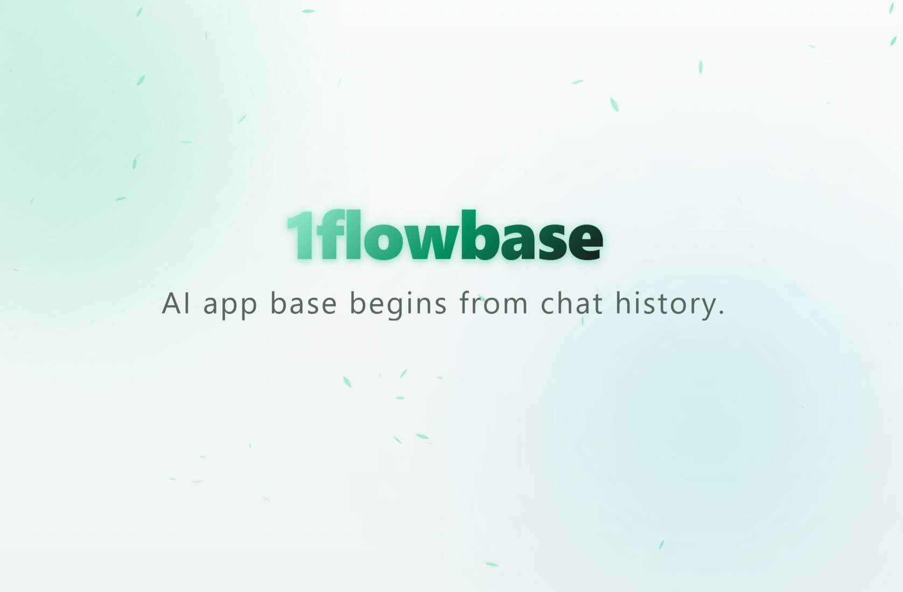
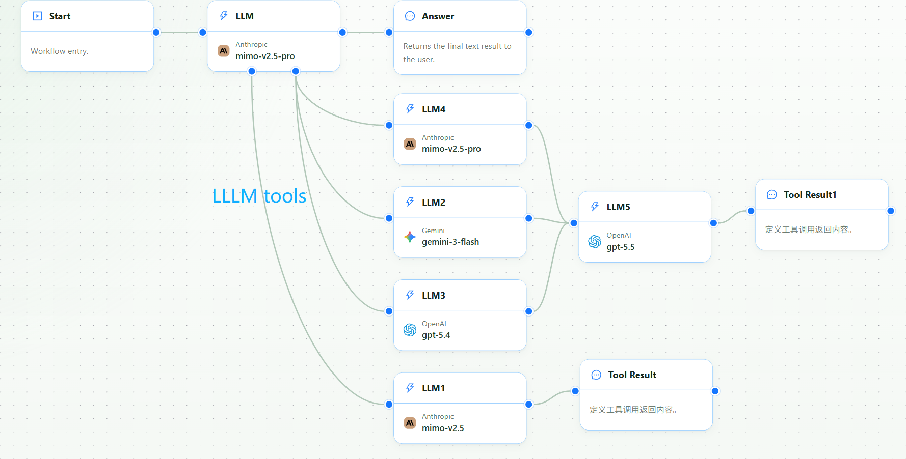

# 1flowbase

<p align="center">
  
</p>

<p align="center">
  <b>English</b> | <a href="docs/READEME-i18n/README_CN.md">简体中文</a>
</p>

<p align="center">
  <a href="https://github.com/taichuy/1flowbase/stargazers"></a>
  <a href="LICENSE"></a>
  
  
  
</p>

<p align="center">
  <strong>Community:</strong>
  <a href="docs/assets/community/wechat.jpg" target="_blank">WeChat</a> |
  <a href="docs/assets/community/taichuy_doc_wechat_office.png" target="_blank">WeChat Official Account</a> |
  <a href="https://x.com/Tacihu2021" target="_blank">Twitter</a>
</p>

> **Give local AI agents one model endpoint that can run your own observable multi-model workflow behind the scenes.**

Claude Code, Codex, OpenCode, Cline, Continue, and SDKs call one normal model name. 1flowbase can run a workflow behind that name: mount a vision model for screenshots, call several models as a Fusion-style review panel, verify or format the result, and show the full trace of model calls, tool callbacks, tokens, latency, and failures.

```text
Agent client -> one virtual model endpoint -> your workflow -> trace / tokens / cost -> final answer
```

| If you need to... | 1flowbase helps you... |
|---|---|
| make a text coding model understand screenshots | mount GLM-5V-Turbo, Gemini, GPT vision, OCR, or another visual model as a tool |
| run a Fusion-style model panel | fan out to several branch models, synthesize the result, and publish it as one endpoint |
| debug why an agent answer was slow, expensive, or wrong | inspect workflow nodes, model calls, tool callbacks, token usage, latency, and errors |
| reuse a better model chain from existing clients | publish the workflow as OpenAI-compatible or Claude-compatible model APIs |



---

## What You Can Build

### Add vision to text-first coding models

Keep GLM-5.2, DeepSeek, or another strong text coding model as the main planner, then let 1flowbase route screenshots, UI images, charts, and PDF pages to a mounted vision model.

```text
Claude Code
  -> 1flowbase virtual model endpoint
  -> GLM-5.2 / DeepSeek / other main coding model
  -> mounted vision tool
  -> GLM-5V-Turbo / Gemini / GPT vision / OCR model
  -> structured visual result
  -> final coding answer
```

Guide: [Make GLM-5.2 See Images in Claude Code with 1flowbase](https://github.com/taichuy/1flowbase/wiki/Make-GLM-5.2-See-Images-in-Claude-Code-with-1flowbase)

### Publish a Fusion-style multi-model reviewer

1flowbase includes a `fusion` template. Your client calls one model name; 1flowbase asks several branch models, runs a synthesis model, returns the final answer, and keeps every branch visible.

```text
User request
  -> Main LLM
  -> fusion tool
     -> Branch LLM A
     -> Branch LLM B
     -> Branch LLM C
     -> Synthesis LLM
  -> final answer
```

Guide: [Fusion-Style Workflows: Publish a Multi-Model Panel as an Observable Virtual Model](https://github.com/taichuy/1flowbase/wiki/Fusion-Style-Workflow)

### Publish workflow-backed model APIs

Build the workflow once, then expose it through common model APIs:

| Protocol | API path | Typical usage |
|---|---:|---|
| OpenAI Responses API | `/v1/responses` | newer OpenAI-style clients and application code |
| OpenAI Chat Completions API | `/v1/chat/completions` | SDKs, coding tools, chat clients, application frameworks |
| Claude-compatible Messages API | `/v1/messages` | Claude-compatible clients that support custom endpoints |

---

## Installation or Upgrade

Linux/macOS:

```bash
curl -fsSL https://raw.githubusercontent.com/taichuy/1flowbase/main/scripts/shell/docker-deploy.sh | sh
```

Windows PowerShell:

```powershell
irm https://raw.githubusercontent.com/taichuy/1flowbase/main/scripts/powershell/docker-deploy.ps1 | iex
```

Windows CMD:

```cmd
powershell -NoProfile -ExecutionPolicy Bypass -Command "irm https://raw.githubusercontent.com/taichuy/1flowbase/main/scripts/powershell/docker-deploy.ps1 | iex"
```

---

## Run From Source

Use this path when you want to develop 1flowbase itself.

Requirements: Node.js `>= 24.0.0`, pnpm, latest stable Rust, and Docker for local middleware.

```bash
git clone https://github.com/taichuy/1flowbase.git
cd 1flowbase

docker compose -f docker/docker-compose.middleware.yaml up -d

cd web
pnpm install
pnpm dev
```

Frontend:

```text
http://127.0.0.1:3100
```

Start backend services:

```bash
cd api
# Copy api/apps/api-server/.env.example to .env before the first run.
cargo run -p api-server --bin api-server
cargo run -p plugin-runner --bin plugin-runner
```

Default backend endpoints:

```text
API Server: http://127.0.0.1:7800
Plugin Runner: http://127.0.0.1:7801
```

Script-assisted startup:

```bash
node scripts/node/dev-up.js
node scripts/node/dev-up.js status
node scripts/node/dev-up.js stop
node scripts/node/dev-up.js restart
```

See [scripts/README.md](scripts/README.md) for more options.

---

## Where 1flowbase Fits

1flowbase is not just a model proxy and not just a generic workflow canvas.

| Tool category | What it usually does | How 1flowbase is different |
|---|---|---|
| LLM gateway / model router | routes one request to one provider or model | composes multiple model and tool nodes into one workflow-backed virtual model |
| AI workflow builder | builds an AI app or workflow | exposes the workflow as OpenAI / Claude-compatible model APIs |
| Agent framework | helps developers code agent graphs | provides a visual runtime, protocol publishing, and execution logs |
| Observability / cost tracker | shows token or spend totals | connects cost to workflow nodes, model calls, tool callbacks, and trace logs |

```text
Model routers choose a model.
1flowbase builds a new virtual model from a workflow.
```

---

## Feature Preview

### Publish as OpenAI-compatible API


### Publish as Claude-compatible Messages API


### Customize exposed model information


### Use in local AI agent clients

Call a published workflow from compatible clients that support custom model endpoints.


### Inspect execution logs

Trace model requests, node inputs and outputs, tool callbacks, response content, latency, and errors.


### View tool callback traces


### Track token consumption


---

## Common Use Cases

### Make a text coding model understand screenshots

```text
Screenshot / UI mockup / chart
  -> vision tool
  -> structured visual context
  -> strong coding model
  -> patch, plan, or explanation
```

Useful for UI reconstruction, frontend debugging, visual regression analysis, chart reading, PDF page understanding, and design-to-code workflows.

### Build a Fusion-style reviewer

```text
Architecture proposal
  -> cheap broad reviewer
  -> strong reasoning reviewer
  -> provider-diverse reviewer
  -> synthesis model
  -> final recommendation
```

Useful for architecture review, research synthesis, code review, document review, and high-stakes agent decisions.

### Control cost with model cascading

```text
Simple classification -> small model
Formatting -> small model
Complex reasoning -> strong model
Final verification -> verifier node
```

### Guarantee output structure

Use verifiers, JSON Schema validation, and formatter nodes before returning the final result. This is useful for JSON outputs, API responses, tool call parameters, code patches, document generation, and automated task results.

### Build a programmable upstream model for agents

```text
Code generation -> test / lint check -> reviewer node -> fix node -> final patch
```

The client calls one model name while 1flowbase runs your workflow behind it.

---

## Current Status

### Implemented

- [x] visual workflow editor
- [x] multi-node workflow orchestration
- [x] virtual model endpoint publishing
- [x] OpenAI Responses protocol support
- [x] OpenAI Chat Completions protocol support
- [x] Claude-compatible Messages protocol support
- [x] streaming response support
- [x] mounted LLM tools for multimodal and branch-model workflows
- [x] `fusion` workflow template
- [x] execution logs
- [x] tool callback traces inside 1flowbase workflows
- [x] application-level token consumption statistics
- [x] prompt and model configuration version history

### Enhancing

- [ ] deeper local agent conversation collection
- [ ] session search and playback
- [ ] Token Bill of Materials by prompt, history, tool definitions, command outputs, media inputs, and nodes
- [ ] abnormal cost detection and optimization suggestions
- [ ] session export and Recall Pack generation
- [ ] more Claude Code / Codex / OpenCode / Cline / Continue templates
- [ ] MCP-aware plugin nodes and tool-call source attribution

### Planned

- [ ] low-code application building platform for AI organizations
- [ ] team workspace and multi-tenant management
- [ ] permissions, approval, audit, and cost governance
- [ ] support for more local AI agent clients
- [ ] template market and workflow recipe ecosystem

> Note: 1flowbase is not currently positioned as an MCP server or MCP gateway. MCP-aware capabilities are on the roadmap. The current product focuses on publishing compatible model endpoints and tracing 1flowbase workflow execution.

---

## Transparency and Security

1flowbase is designed for transparent, self-hosted AI workflow execution.

Recommended principles:

- self-hosted first
- transparent model chains
- auditable node calls
- traceable token usage
- configurable log retention
- sensitive data masking
- explicit model and workflow configuration

1flowbase does not advocate stealthy model replacement. Published endpoints should be configured intentionally, observed clearly, and governed by the project owner.

---

## Guides

- [Make GLM-5.2 See Images in Claude Code with 1flowbase](https://github.com/taichuy/1flowbase/wiki/Make-GLM-5.2-See-Images-in-Claude-Code-with-1flowbase)
- [Fusion-Style Workflows: Publish a Multi-Model Panel as an Observable Virtual Model](https://github.com/taichuy/1flowbase/wiki/Fusion-Style-Workflow)
- [1flowbase Wiki](https://github.com/taichuy/1flowbase/wiki)

---

## Repo Layout

```text
web/          Frontend root, powered by pnpm + Turbo
api/          Rust backend workspace
api/apps/     Backend service entry points
api/crates/   Shared backend crates
api/plugins/  Plugin workspace, HostExtension manifests, and templates
docker/       Local middleware orchestration and self-hosted stack
scripts/      Development, testing, verification, and debugging scripts
```

---

## Contributing

Contributions are welcome. Before submitting a pull request, run:

```bash
node scripts/node/verify.js repo
```

Project guidelines:

- [AGENTS.md](AGENTS.md)
- [web/AGENTS.md](web/AGENTS.md)
- [api/AGENTS.md](api/AGENTS.md)

---

## Friend Links

- [Linux.do](https://linux.do/) - Learn AI, on L Station.
- [Aionui](https://github.com/iOfficeAI/AionUi) - Remotely control AI to work via mobile phone.
- [OfficeCLI](https://github.com/iOfficeAI/OfficeCLI) - Office suite designed for AI agents.
- [deepseek-pp](https://github.com/zhu1090093659/deepseek-pp) - DeepSeek web chat browser extension.
- [MuseAI](https://github.com/yejiming/MuseAI) - Local AI companion, text adventure, and story immersion app.
- [FrontAgent](https://github.com/FrontAgent/FrontAgent) - AI Agent system designed specifically for front-end engineering.
- [RedBox](https://github.com/Jamailar/RedBox) - Localized AI creative workbench for Xiaohongshu creators.

---

## License

This project is licensed under [Apache-2.0](LICENSE).

---

## Contributors

<p align="center">
  <a href="https://github.com/taichuy/1flowbase/graphs/contributors">
    
  </a>
</p>

---

## Star History

<p align="center">
  <a href="https://www.star-history.com/#taichuy/1flowbase&Date" target="_blank">
    
  </a>
</p>

---

<div align="center">

**If you want local AI agents to call observable multi-model virtual models, give 1flowbase a star.**

[Report Bug](https://github.com/taichuy/1flowbase/issues) · [Request Feature](https://github.com/taichuy/1flowbase/issues)

</div>
